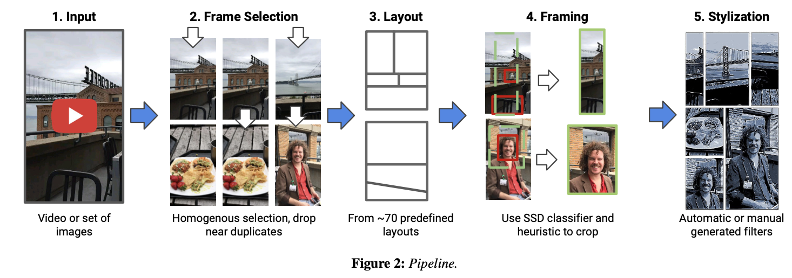
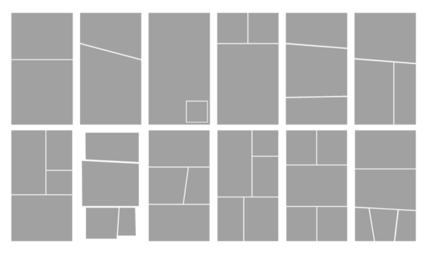
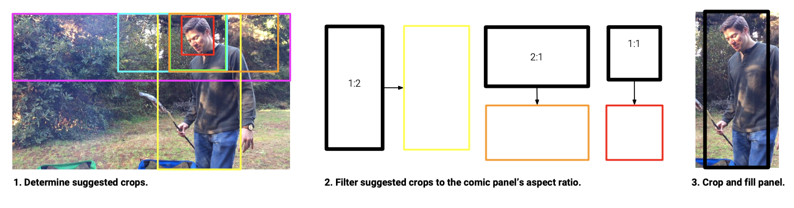
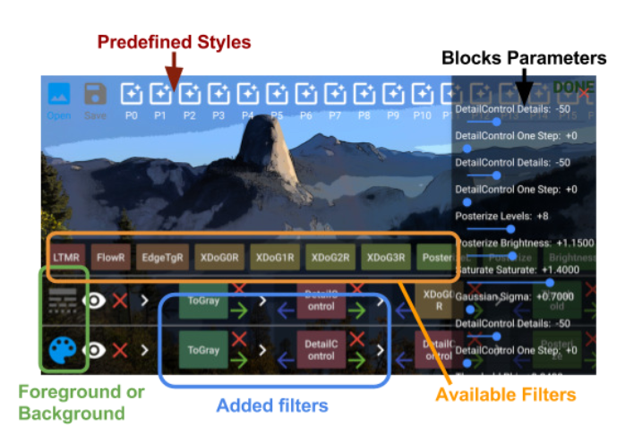
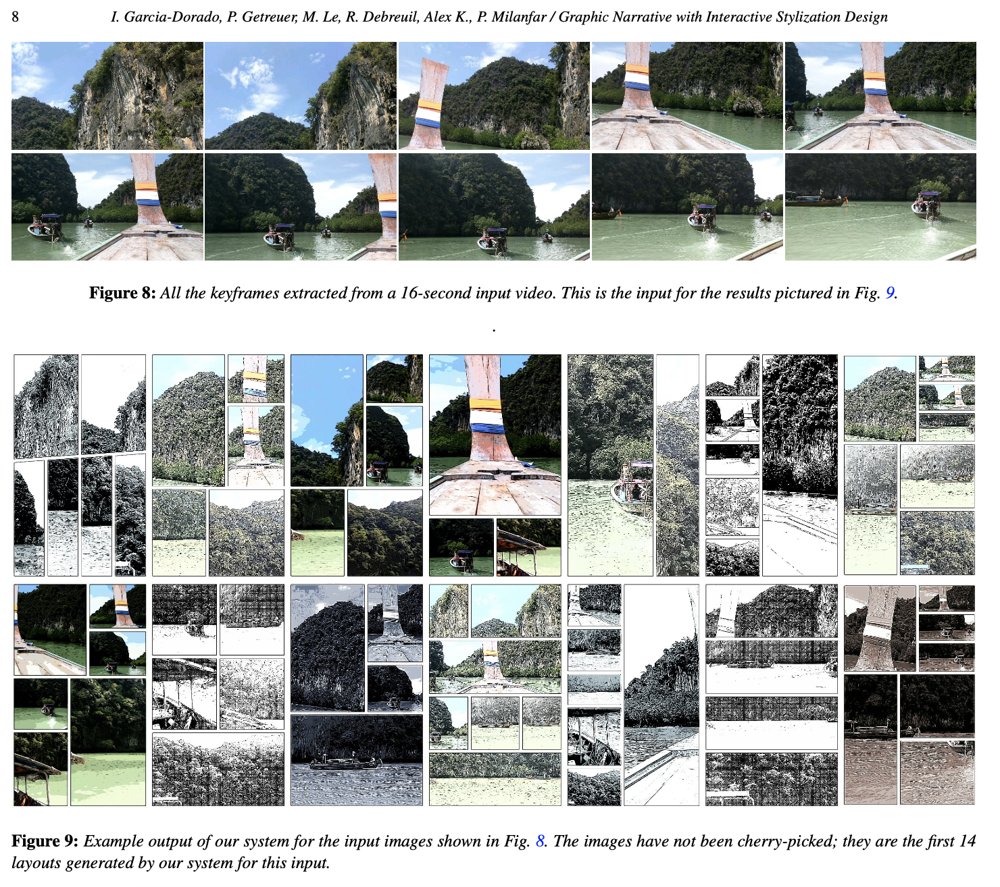

## ”Graphic Narrative with Interactive Stylization Design“ 学习笔记

### **文章目标**

将照片或视频转换为故事板，并为用户创建一种实时的交互工具。

###  **主要步骤**

1. **选择内容图像** 

* 首先要去除视频序列中近似重复的图像。这里使用的是改良版的感知哈希算法，比较图像指纹之间的差异。
* 在所有近似图像中找到最清晰的一张。通过计算图像梯度来得到图像锐度。

2. **确定布局**
* 依靠设计师手动创建预设布局集。如下图所示。

3. **取景**

* 考虑的是在已有的图像中选择哪些部分放到布局框中。
* 使用两个CNN，一个检测人脸，一个检测物体。
* 得到检测返回的边界框后将其按一定规则扩展/裁剪以匹配目标布局框。

4. **使用交互工具来添加风格**
* 改变图像风格使其更具有艺术感。（类似美图APP中的滤镜功能）

* 滤波器的基本效果有：改变灰度，着色，色调分离，改亮度，阈值，饱和度，改变大小。
* 滤波器的高级效果：油画风格，检测边缘，半色调，改变图像动态范围等。

###  **结果**
* 最终效果

